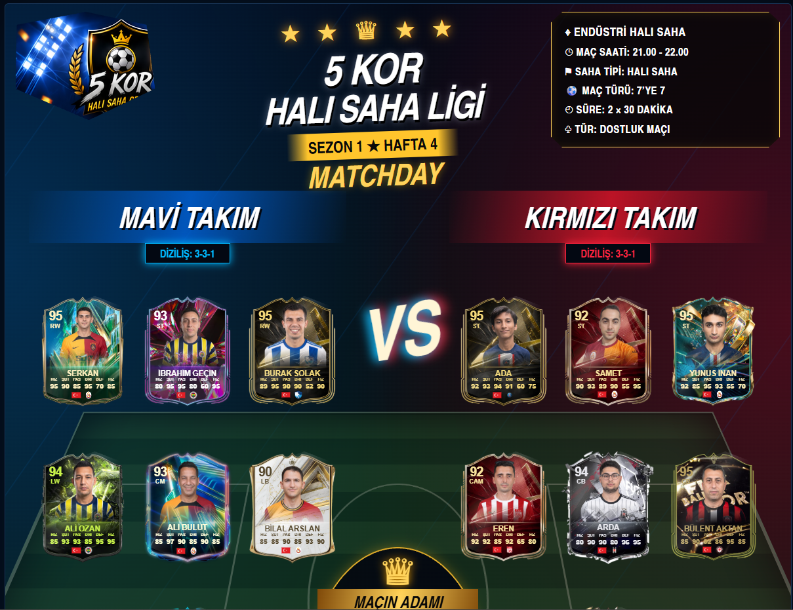
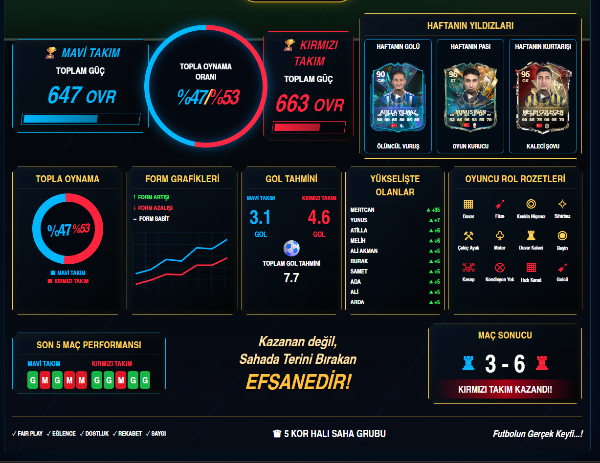
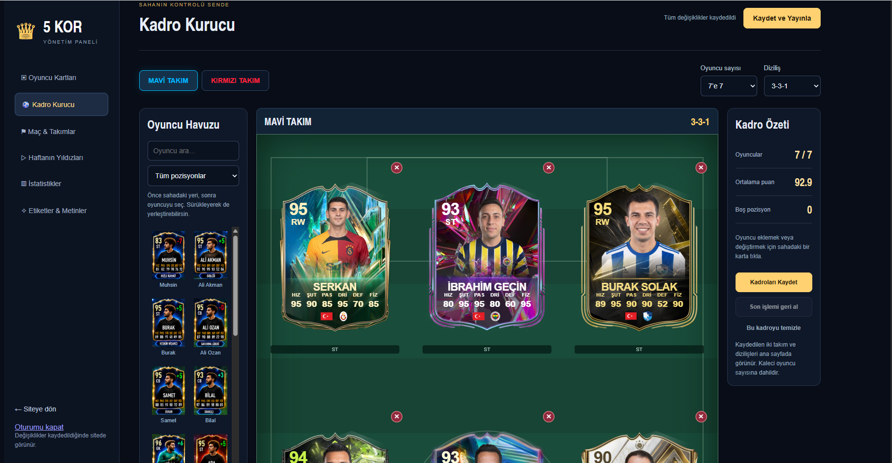
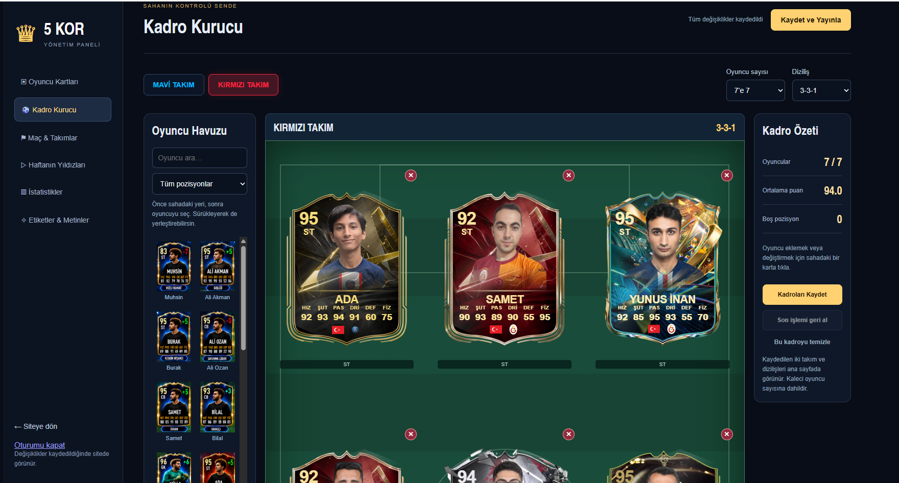
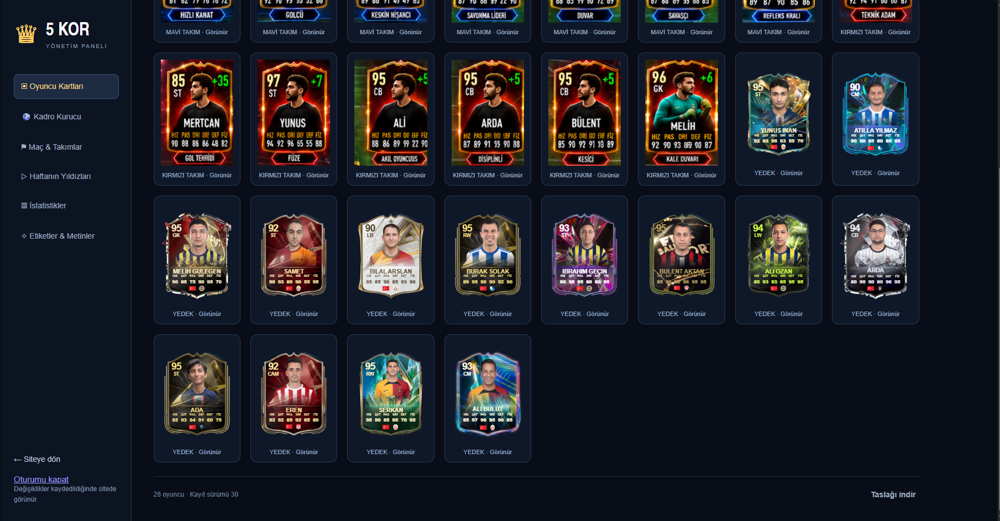
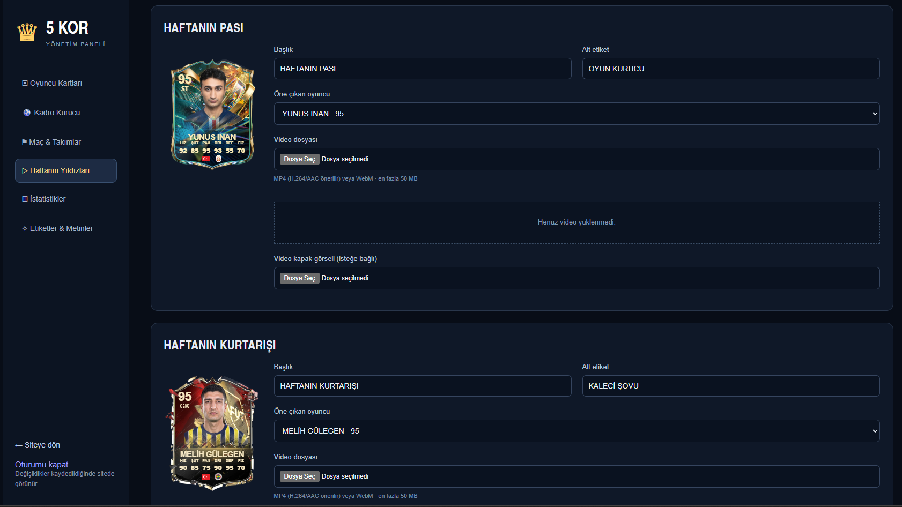
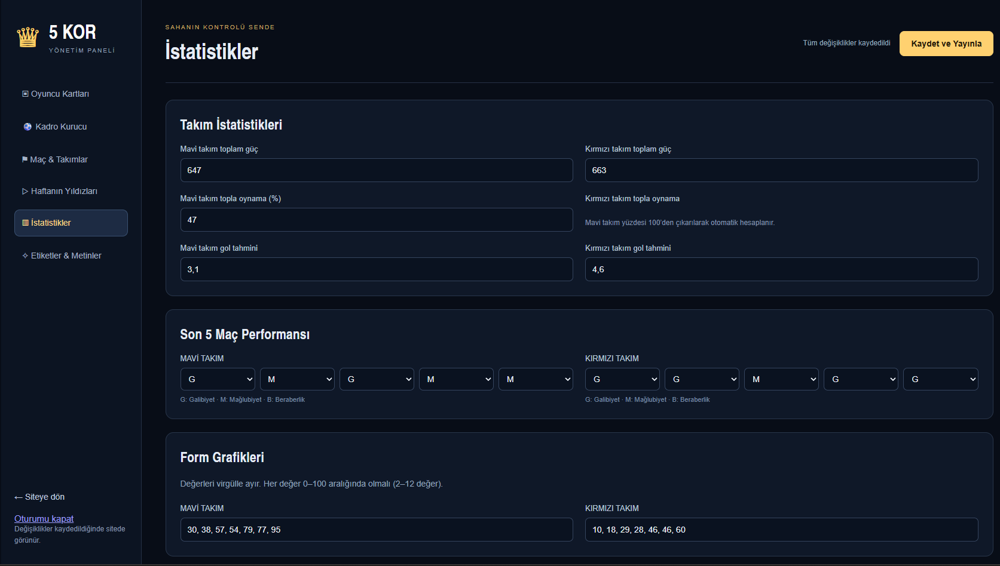
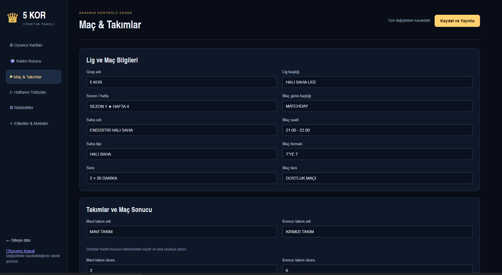
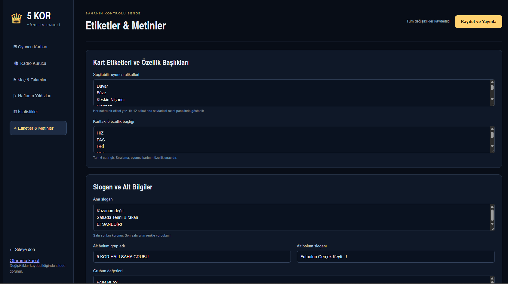

# 👑 5 Kor Halı Saha Ligi · ASP.NET Core & FIFA Kart Yönetim Sistemi

> **TR**: Bu proje, 5 Kor Halı Saha Ligi için FIFA tarzı oyuncu kartları, kadro kurucu, maç ve takım istatistikleri ile haftanın öne çıkan video içeriklerini yöneten ASP.NET Core tabanlı bir web uygulamasıdır.  
> **EN**: This project is an ASP.NET Core web application built for the 5 Kor Amateur Football League featuring FIFA-style player cards, a squad builder, match & team analytics, and weekly video highlights management.

---

## 🇹🇷 TÜRKÇE DOKÜMANTASYON

### 1. Proje Amacı ve Özellikleri
5 Kor Halı Saha Ligi uygulaması, halı saha maç günlerinin dijital ve interaktif ortama taşınmasını sağlar.

- **FIFA Tarzı Oyuncu Kartları**: Oyuncuların mevki, OVR, reyting değişimi, istatistikleri ve özel rol etiketleri ile FIFA kart tasarımında sergilenmesi.
- **Kırmızı & Mavi Takım Kadroları ve Dizilişleri**: Saha üzerinde dinamik oyuncu yerleşimi (3-3-1 vb.), kadro özetleri ve yedek oyuncu listesi.
- **Gelişmiş Yönetim Paneli (`/admin`)**:
  - **Oyuncu Kartları Yönetimi**: Oyuncu ekleme, istatistik/mevki düzenleme ve hazır/özel kart şablonu seçimi.
  - **Kadro Kurucu**: Sürükle-bırak mantığıyla saha üzerine oyuncu yerleştirme ve diziliş yönetimi.
  - **Maç & Takımlar**: Saha adı, maç saati, maç türü, skorlar ve lig bilgilerini güncelleme.
  - **Haftanın Yıldızları**: Haftanın Golü, Haftanın Pası ve Haftanın Kurtarışı için MP4/WebM video ve kapak görseli yükleme.
  - **İstatistikler**: Toplam güç (OVR), topla oynama oranları, gol tahminleri, form grafikleri ve son 5 maç performansları.
  - **Etiketler & Metinler**: Oyuncu rol rozetleri, kart özellik başlıkları ve slogan özelleştirme.
- **FIFARosters Şablon Galerisi Entegrasyonu**: Çevrimiçi galeriden kart şablonlarını tarama ve projeye aktarma (`GalleryService`).
- **Özel Medya Depolama**: Yüklenen görseller ve videolar için HTTP Range destekli medya sunumu.

---

### 2. Teknolojiler ve Mimari

| Katman / Bileşen | Kullanılan Teknolojiler |
| --- | --- |
| **Çalışma Zamanı** | .NET 10.0 (`net10.0`) Web API / Minimal APIs |
| **Veritabanı** | SQLite (`Microsoft.EntityFrameworkCore.Sqlite`) |
| **Veri Erişim Katmanı** | Entity Framework Core (EF Core 10.0) |
| **Ön Yüz (Frontend)** | HTML5, Modern Vanilla CSS3, JavaScript (ES Modules, HTML5 Canvas) |
| **Kimlik Doğrulama & Güvenlik** | Cookie-based Auth (`FiveKor.Admin`), ASP.NET Core Antiforgery (CSRF Token), Password Hashing, Rate Limiting (Fixed Window), Security Headers (CSP, HSTS, X-Content-Type-Options) |
| **Yardımcı Araçlar** | Python (`tools/import_state.py` veri ve medya içe aktarma betiği) |

---

### 3. Klasör Yapısı

```
FiveKorDotNet/
├── screenshots/               # Ekran görüntüleri (Uygulama ve Yönetim Paneli)
├── tools/                     # Yardımcı betikler (import_state.py vb.)
├── src/
│   └── FiveKor.Web/           # Ana ASP.NET Core Projesi
│       ├── App_Data/          # SQLite veritabanı (fivekor.db), anahtarlar ve medya yüklemeleri
│       ├── Data/              # EF Core DbContext (AppDbContext.cs) ve varlıklar
│       ├── Models/            # DTO ve veri sözleşmeleri (Contracts.cs)
│       ├── Services/          # StateService.cs (durum yönetimi), GalleryService.cs (şablon galerisi)
│       ├── Properties/        # Proje yapılandırmaları
│       ├── private/           # Yönetici HTML şablonları (admin.html)
│       ├── wwwroot/           # Statik web dosyaları (CSS, JS, ikonlar, resimler)
│       ├── Program.cs         # Minimal API uç noktaları, güvenlik ve uygulama yapılandırması
│       ├── FiveKor.Web.csproj # Proje bağımlılıkları ve hedef .NET framework
│       └── appsettings.Example.json # Örnek yapılandırma dosyası
├── README.md                  # Proje dokümantasyonu (TR/EN)
└── .gitignore                 # Visual Studio, .NET ve runtime veri dışlama kuralları
```

---

### 4. Kurulum ve Yerel Çalıştırma

#### Ön Koşullar
- [.NET 10.0 SDK](https://dotnet.microsoft.com/download) veya .NET 10 destekli Visual Studio 2022+ / JetBrains Rider.

#### Visual Studio ile Çalıştırma
1. `src/FiveKor.Web/FiveKor.Web.csproj` dosyasını Visual Studio ile açın.
2. Başlangıç projesi olarak `FiveKor.Web` seçildiğinden emin olun.
3. `F5` veya `Ctrl+F5` ile projeyi derleyip çalıştırın.

#### .NET CLI (Terminal) ile Çalıştırma
1. Terminali `src/FiveKor.Web` klasöründe açın.
2. İlk çalıştırma öncesinde yönetici hesabı yapılandırmasını belirleyin (örnek değerlerle):

   **PowerShell:**
   ```powershell
   $env:Admin__Email = "admin@example.com"
   $env:Admin__Password = "GüvenliŞifrenizEnAz12Karakter"
   dotnet run
   ```

   **CMD:**
   ```cmd
   set Admin__Email=admin@example.com
   set Admin__Password=GüvenliŞifrenizEnAz12Karakter
   dotnet run
   ```

3. Uygulama başlatıldığında varsayılan olarak `http://localhost:5000` (veya gösterilen HTTPS portu) üzerinden yayına girecektir.

---

### 5. Veritabanı, Yönetici Hesabı ve Medya Yönetimi

- **Veritabanı Başlatma**: İlk çalıştırmada `EF Core EnsureCreatedAsync()` veritabanı tablosunu (`App_Data/fivekor.db`) otomatik oluşturur. Veritabanı boşsa `App_Data/seed.json` içerisindeki başlangıç kadrosu ve lig ayarları otomatik yüklenir.
- **Yönetici Hesabı Oluşturma**: İlk açılışta `Admin__Email` and `Admin__Password` (en az 12 karakter) yapılandırması okunur; şifre `IPasswordHasher` ile hash'lenerek `admin_accounts` tablosuna kaydedilir. Sonraki çalıştırmalarda bu ortam değişkenlerine tekrar gerek kalmaz.
- **Yüklenen Medya Dosyaları**: Kullanıcıların yüklediği oyuncu kart görselleri ve videolar `App_Data/media/` klasöründe benzersiz UUID isimleriyle saklanır.

---

### 6. Windows Hosting ve Canlı Ortam Yayın Bilgisi

- **Yayın Seçeneği**: Windows Server (IIS) üzerinde ASP.NET Core Hosting Bundle ile `InProcess` modunda kolayca barındırılabilir.
- **Veri Dizin Güvenliği**: Canlı sunucuda veritabanı ve medya klasörünün uygulama güncellemelerinde silinmemesi için `FIVEKOR_DATA_DIR` ortam değişkenine sunucu üzerindeki kalıcı bir klasörün **mutlak yolu** verilmelidir (Örn: `C:\FiveKorData`).
- **Güvenlik Notu**: HTTPS yönlendirmesi, HSTS ve CSP başlıkları canlı ortamda otomatik aktif hale gelir.

---

### 7. Ekran Görüntüleri

Aşağıda `screenshots/` klasöründe yer alan uygulama ve yönetim paneli görselleri listelenmiştir:

| Görsel | Açıklama |
| --- | --- |
|  | **Ana Sayfa - Matchday & Takım Kadroları**: Mavi ve Kırmızı Takım oyuncu kartları, dizilişler ve maç bilgileri. |
|  | **Ana Sayfa - İstatistik & Analiz Paneli**: Topla oynama oranları, form grafikleri, gol tahminleri ve haftanın yıldızları. |
|  | **Yönetim Paneli - Kadro Kurucu (Mavi Takım)**: Sürükle-bırak ile oyuncu seçimi ve saha dizilişi yönetimi. |
|  | **Yönetim Paneli - Kadro Kurucu (Kırmızı Takım)**: Kırmızı takım kadro diziliş ekranı. |
|  | **Yönetim Paneli - Oyuncu Kartları**: Mevcut tüm oyuncu kartlarının listelenmesi ve yönetimi. |
|  | **Yönetim Paneli - Haftanın Yıldızları**: Haftanın golü, pası ve kurtarışı video/görsel yükleme ekranı. |
|  | **Yönetim Paneli - İstatistik Editörü**: Takım güçleri, form değerleri ve son 5 maç sonuçları yönetimi. |
|  | **Yönetim Paneli - Maç & Takım Bilgileri**: Saha adı, maç saati ve skor ayarları. |
|  | **Yönetim Paneli - Etiketler & Metinler**: Rol rozetleri, sloganlar ve dipnot alanları. |

---

<br/>

## 🇬🇧 ENGLISH DOCUMENTATION

### 1. Project Purpose & Features
The 5 Kor Amateur Football League project transforms local amateur matchdays into an interactive, broadcast-quality web experience.

- **FIFA-Style Player Cards**: Display players with custom stats, OVR ratings, form trends, positions, and specialized role badges.
- **Red & Blue Team Lineups & Tactics**: Dynamic pitch layout supporting 3-3-1 formations, team summaries, and substitute player rosters.
- **Comprehensive Admin Panel (`/admin`)**:
  - **Player Card Management**: Add/edit players, update stats/positions, and select template cards.
  - **Squad Builder**: Tactical board for positioning players on the field with drag-and-drop mechanics.
  - **Match & Teams**: Update match location, kickoff times, game format, scores, and league info.
  - **Stars of the Week**: Upload MP4/WebM video clips and poster images for Goal of the Week, Assist of the Week, and Save of the Week.
  - **Analytics & Stats**: Edit total OVR power, possession percentage, predicted goals, form trendlines, and recent 5 matches history.
  - **Tags & Texts**: Custom role badges, card attribute labels, and site footer slogans.
- **FIFARosters Template Gallery Integration**: Browse and import card templates directly via `GalleryService`.
- **Media Streaming**: Dedicated media endpoint with HTTP Range support for video playbacks.

---

### 2. Tech Stack & Architecture

| Layer / Component | Technology Used |
| --- | --- |
| **Runtime** | .NET 10.0 (`net10.0`) Web API / Minimal APIs |
| **Database** | SQLite (`Microsoft.EntityFrameworkCore.Sqlite`) |
| **Data Access** | Entity Framework Core (EF Core 10.0) |
| **Frontend** | HTML5, Modern Vanilla CSS3, JavaScript (ES Modules, HTML5 Canvas) |
| **Security & Auth** | Cookie-based Auth (`FiveKor.Admin`), Anti-Forgery CSRF Tokens, Password Hashing, Rate Limiting, Security Headers (CSP, HSTS) |
| **Tools** | Python (`tools/import_state.py` data migration utility) |

---

### 3. Folder Structure Overview

```
FiveKorDotNet/
├── screenshots/               # Screenshots (UI and Admin Panel)
├── tools/                     # Helper tools (import_state.py)
├── src/
│   └── FiveKor.Web/           # Main ASP.NET Core Project
│       ├── App_Data/          # SQLite database (fivekor.db), keys, and uploaded media
│       ├── Data/              # EF Core DbContext (AppDbContext.cs)
│       ├── Models/            # DTOs and Data Contracts (Contracts.cs)
│       ├── Services/          # StateService.cs & GalleryService.cs
│       ├── Properties/        # Project launch settings
│       ├── private/           # Protected admin view template (admin.html)
│       ├── wwwroot/           # Public web assets (CSS, JS, icons)
│       ├── Program.cs         # Application entry point, Minimal APIs & security
│       ├── FiveKor.Web.csproj # Project file
│       └── appsettings.Example.json # Example configuration file
├── README.md                  # Project Documentation (TR/EN)
└── .gitignore                 # Git ignore rules for .NET & Visual Studio
```

---

### 4. Prerequisites & Local Setup

#### Prerequisites
- [.NET 10.0 SDK](https://dotnet.microsoft.com/download) or Visual Studio 2022+ / JetBrains Rider supporting .NET 10.

#### Running with Visual Studio
1. Open `src/FiveKor.Web/FiveKor.Web.csproj` in Visual Studio.
2. Ensure `FiveKor.Web` is selected as the startup project.
3. Press `F5` or `Ctrl+F5` to build and run.

#### Running via .NET CLI
1. Open terminal in `src/FiveKor.Web`.
2. Configure initial admin account credentials (using example values):

   **PowerShell:**
   ```powershell
   $env:Admin__Email = "admin@example.com"
   $env:Admin__Password = "YourSecurePasswordMin12Chars"
   dotnet run
   ```

3. Open `http://localhost:5000` in your web browser.

---

### 5. Database, Admin Setup & Media Storage

- **Database Initialization**: On first run, `EnsureCreatedAsync()` initializes `App_Data/fivekor.db`. If empty, default data is seeded from `App_Data/seed.json`.
- **First-Time Admin Setup**: Reads `Admin__Email` and `Admin__Password` (min 12 chars), hashes password using `IPasswordHasher`, and stores it in `admin_accounts`.
- **Media Uploads**: Player photos and video highlights are saved under `App_Data/media/` named with unique UUIDs.

---

### 6. Deployment Note for Windows Hosting

- **Hosting**: Can be deployed to Windows IIS with ASP.NET Core Hosting Bundle installed.
- **Data Persistence**: Set `FIVEKOR_DATA_DIR` environment variable to a absolute path on the server outside the deployment folder (e.g. `C:\FiveKorData`) to persist SQLite database and uploaded media across deployments.

---

### 7. Screenshots Overview

| Screenshot | Description |
| --- | --- |
|  | **Main Page - Matchday & Lineups**: Red & Blue team rosters, cards, and match metadata. |
|  | **Main Page - Analytics Dashboard**: Possession chart, form trends, goal predictions, and weekly highlights. |
|  | **Admin Panel - Squad Builder (Blue Team)**: Drag-and-drop tactical squad builder. |
|  | **Admin Panel - Squad Builder (Red Team)**: Red team formation setup screen. |
|  | **Admin Panel - Player Cards**: Grid listing all created player cards. |
|  | **Admin Panel - Weekly Highlights**: Upload Goal/Pass/Save of the week videos. |
|  | **Admin Panel - Statistics Editor**: Team ratings, form scores, and past match results. |
|  | **Admin Panel - Match Details**: Venue name, match hours, and score setup. |
|  | **Admin Panel - Tags & Text Settings**: Role badges, slogans, and custom text settings. |
